# Auto Watering System

Raspberry Pi + Arduino による自動給水システム

## システム概要

```
┌──────────────┐
│  スマートフォン  │
│  (ブラウザ)    │
└──────┬───────┘
       │ Google Spreadsheet で設定変更 / データ閲覧
       ▼
┌──────────────────────────────────────────────────┐
│              Google Spreadsheet                   │
│  「設定」シート ← スマホから書き込み                     │
│  「センサーログ」「給水履歴」← ラズパイが書き込み           │
└──────────────────────┬───────────────────────────┘
                       │ Google Sheets API (ポーリング)
                       ▼
┌──────────────────────────────────────────────────┐
│  Raspberry Pi 5 (8GB)                             │
│                                                   │
│  main.py ─┬─ スケジューラ (定時給水判定)              │
│           ├─ ConfigManager (yaml + Sheets マージ)  │
│           ├─ WateringController (給水判定・実行)      │
│           ├─ SheetsClient (設定読取/ログ書込)         │
│           └─ ArduinoDriver (シリアル通信)            │
└──────────────────────┬───────────────────────────┘
                       │ USB Serial
                       ▼
┌──────────────────────────────────────────────────┐
│  Arduino Nano 互換 (USB Type-C)                   │
│  watering_driver.ino (コマンド応答のみ)              │
│  ├─ 土壌湿度センサー ×2 (静電容量式)                  │
│  ├─ 水位センサー ×1 (フロートスイッチ)                 │
│  ├─ 温湿度センサー (DHT22)                          │
│  └─ ラッチリレー → 給水ポンプ                         │
└──────────────────────────────────────────────────┘
```



```mermaid
---
title: モロヘイヤ自動水やりシステム 全体構成図
---

graph TB
    subgraph RaspberryPi["🖥️ Raspberry Pi"]
        RPi_USB["USB-A ポート"]
        RPi_App["制御アプリ\n（Python）"]
        RPi_Discord["Discord Webhook\n通知モジュール"]
        RPi_App --> RPi_Discord
        RPi_App --> RPi_USB
    end

    subgraph FPC["📎 FPC フラットケーブル 1m"]
        FPC_Cable["USB-A ⇔ USB-C\n電源 + シリアル通信"]
    end

    subgraph Arduino["⚡ Arduino Nano（CH340C / Type-C）"]
        Nano_Serial["シリアル通信\nUSB経由"]
        Nano_D7["D7 → リレー制御"]
        Nano_D2["D2 ← フロートSW\n（INPUT_PULLUP）"]
        Nano_A0["A0 ← 土壌水分センサー"]
        Nano_A1["A1 ← 電池電圧監視"]
        Nano_5V["5V 出力"]
        Nano_GND["GND"]
    end

    subgraph Relay["🔌 5V 1ch リレーモジュール"]
        Relay_VCC["VCC"]
        Relay_GND["GND"]
        Relay_IN["IN（制御信号）"]
        Relay_COM["COM"]
        Relay_NO["NO（常開）"]
    end

    subgraph Pump["⛽ 灯油ポンプ（工進 EP-306 改造）"]
        Pump_Motor["DCモーター"]
        Pump_Nozzle["ノズル\n（先端カット済）"]
        Battery["単三電池 ×2\n（3V）"]
        Wire_Black["黒線（GND）"]
        Wire_Gray["灰色線（電源）"]
        Wire_Blue["藍色線（信号）\n※絶縁して未使用"]
    end

    subgraph Tank["🪣 灯油用ポリタンク 10L"]
        Tank_Body["不透明タンク\n＋アルミ保温シート"]
        Float_SW["フロートスイッチ\n（タンク空検知）"]
        Water["水（＋液肥）"]
    end

    subgraph Planter["🌱 8号植木鉢（モロヘイヤ）"]
        Soil_Sensor["容量性\n土壌水分センサー"]
        Drip_Ring["ドリップリング\nシリコンホース ≈60cm\n（ピン穴 等間隔）"]
        T_Joint["T字ジョイント\n（タカギ 14mm）"]
    end

    subgraph Enclosure["📦 防水ケース（密閉タッパー）"]
        UniBoard["ユニバーサル基板\n4×6cm"]
    end

    subgraph Notification["📱 スマホ通知"]
        Discord_App["Discord アプリ"]
    end

    %% 接続: RPi → FPC → Nano
    RPi_USB -->|"USB-A"| FPC_Cable
    FPC_Cable -->|"USB-C"| Nano_Serial

    %% Nano → リレー
    Nano_D7 -->|"HIGH/LOW"| Relay_IN
    Nano_5V -->|"5V"| Relay_VCC
    Nano_GND -->|"GND"| Relay_GND

    %% リレー → ポンプ電池ライン
    Battery -->|"電池 +"| Relay_COM
    Relay_NO -->|"灰色線 直結"| Pump_Motor
    Wire_Black -->|"電池 −"| Pump_Motor

    %% ポンプ → 配管
    Pump_Nozzle -->|"シリコンチューブ\n内径15mm"| T_Joint
    T_Joint -->|"左右へ分岐"| Drip_Ring

    %% タンク → ポンプ
    Water -->|"吸水"| Pump_Motor

    %% フロートスイッチ
    Float_SW -->|"D2\nタンク空=LOW"| Nano_D2
    Float_SW ---|"GND"| Nano_GND

    %% 土壌水分センサー
    Soil_Sensor -->|"AOUT → A0"| Nano_A0
    Soil_Sensor ---|"VCC"| Nano_5V
    Soil_Sensor ---|"GND"| Nano_GND

    %% 電池電圧監視
    Battery -.->|"分圧抵抗経由"| Nano_A1

    %% Discord 通知
    RPi_Discord -->|"HTTPS\nWebhook"| Discord_App

    %% Nano・リレーは防水ケース内
    Arduino -.->|"収納"| Enclosure
    Relay -.->|"収納"| Enclosure

    %% スタイル
    classDef pi fill:#c8e6c9,stroke:#2e7d32,stroke-width:2px
    classDef nano fill:#bbdefb,stroke:#1565c0,stroke-width:2px
    classDef relay fill:#fff9c4,stroke:#f9a825,stroke-width:2px
    classDef pump fill:#ffccbc,stroke:#d84315,stroke-width:2px
    classDef tank fill:#b3e5fc,stroke:#0277bd,stroke-width:2px
    classDef plant fill:#dcedc8,stroke:#558b2f,stroke-width:2px
    classDef notify fill:#e1bee7,stroke:#7b1fa2,stroke-width:2px
    classDef box fill:#f5f5f5,stroke:#616161,stroke-width:1px,stroke-dasharray: 5 5

    class RaspberryPi pi
    class Arduino nano
    class Relay relay
    class Pump pump
    class Tank tank
    class Planter plant
    class Notification notify
    class Enclosure box
```

## 使用ハードウェア

| 部品 | 型番・仕様 |
|------|-----------|
| マイコン (制御) | **Raspberry Pi 5 (8GB RAM)** |
| マイコン (I/O) | **Arduino Nano 互換 (USB Type-C)** |
| 土壌湿度センサー | 静電容量式 ×2 (例: DIYStudio A1305269P) |
| 水位センサー | フロートスイッチ ×1 |
| 温湿度センサー | DHT22 |
| ポンプ制御 | ラッチリレー |
| 給水ポンプ | USB給水ポンプ |
| 接続 | Raspberry Pi ⇔ Arduino: USB (Type-C) |

## ディレクトリ構成

```
.
├── README.md
├── docs/
│   └── system_design.md              # システム設計書
├── arduino/
│   └── watering_driver/
│       ├── watering_driver.ino       # Arduino ファームウェア
│       └── config.h                  # ピン定義・定数設定
└── raspi/
    ├── main.py                       # エントリポイント (スケジューラ)
    ├── config.yaml                   # ローカル設定 (デフォルト値)
    ├── config_manager.py             # 設定管理 (yaml + Sheets マージ)
    ├── requirements.txt              # Python 依存パッケージ
    ├── arduino/
    │   ├── __init__.py
    │   └── serial_driver.py          # シリアル通信ドライバ
    ├── logic/
    │   ├── __init__.py
    │   └── watering.py               # 給水判定・実行ロジック
    ├── external/
    │   ├── __init__.py
    │   └── sheets.py                 # Google Spreadsheet 連携
    ├── data/
    │   ├── __init__.py
    │   └── logger.py                 # ログ設定
    └── tests/
        ├── __init__.py
        ├── mock_arduino.py           # Arduino シミュレータ
        └── test_serial.py            # シリアルドライバ テスト
```

## セットアップ

### 1. Arduino ファームウェアの書き込み

1. Arduino IDE を開く
2. `arduino/watering_driver/watering_driver.ino` を開く
3. ライブラリマネージャから **DHT sensor library** (Adafruit) をインストール
4. ボード: **Arduino Nano** を選択
5. `config.h` でピン番号を確認・調整してから書き込み

### 2. Raspberry Pi のセットアップ

```bash
# リポジトリをクローン
git clone https://github.com/yappy0622/automatic-water-supply-pi.git
cd automatic-water-supply-pi/raspi

# 依存インストール
pip install -r requirements.txt

# 設定ファイルを編集
cp config.yaml config.yaml.bak
nano config.yaml
# → arduino.port を実際のポートに変更 (例: /dev/ttyUSB0, /dev/ttyACM0)
```

### 3. Google Spreadsheet 連携 (任意)

Spreadsheet 連携を使うと、スマホから設定変更・データ閲覧ができます。

#### 3-1. Google Cloud 側の準備

1. [Google Cloud Console](https://console.cloud.google.com/) でプロジェクト作成
2. **Google Sheets API** を有効化
3. **サービスアカウント** を作成し、JSON キーをダウンロード
4. キーファイルを `raspi/credentials.json` に配置

#### 3-2. Spreadsheet の準備

1. 新しいスプレッドシートを作成
2. 3つのシートを作成:

**「設定」シート** (スマホから値を変更する):

| A列 (項目) | B列 (値) | 説明 |
|------------|---------|------|
| 土壌湿度閾値 | `400` | この値以下で給水 |
| 給水時間(秒) | `10` | ポンプ稼働時間 |
| スケジュール時刻 | `07:00` | カンマ区切りで複数可 |
| 給水モード | `AUTO` | AUTO / MANUAL / OFF |
| 手動給水 | `FALSE` | TRUE にすると即時給水 |
| 通知 | `TRUE` | 通知の有効/無効 |

**「センサーログ」シート**: ヘッダ行のみ作成

```
タイムスタンプ | 土壌1 | 土壌2 | 水位 | 温度 | 湿度 | ポンプ | 備考
```

**「給水履歴」シート**: ヘッダ行のみ作成

```
タイムスタンプ | トリガー | 給水前湿度 | 給水時間(秒) | 給水後湿度 | 結果
```

3. スプレッドシートをサービスアカウントのメールアドレスに **編集者** として共有
4. `config.yaml` を編集:

```yaml
google_sheets:
  enabled: true
  credentials_file: "credentials.json"
  spreadsheet_id: "ここにスプレッドシートIDを貼る"
```

### 4. 起動

```bash
cd raspi

# テスト: 1回だけ給水判定して終了
python main.py --once

# 通常起動 (常駐)
python main.py

# バックグラウンドで起動
nohup python main.py > /dev/null 2>&1 &
```

## 設定の仕組み

```
優先度: Google Spreadsheet の値 > config.yaml の値
```

- `config.yaml` がデフォルト値として常に読み込まれる
- `google_sheets.enabled: true` の場合、Spreadsheet の値でデフォルトが **上書き** される
- Spreadsheet が接続不能な場合は `config.yaml` の値にフォールバック
- Spreadsheet のポーリング間隔は `schedule.sheets_poll_interval_min` で設定 (デフォルト: 5分)

### スマホからの操作例

| やりたいこと | 操作 |
|-------------|------|
| 閾値を変えたい | 「設定」シート B2 の値を変更 → 次回ポーリングで反映 |
| 今すぐ水やりしたい | 「設定」シート B6 を `TRUE` に → ラズパイが検知して即時給水 |
| 水やりを止めたい | 「設定」シート B5 を `OFF` に |
| センサーデータを見たい | 「センサーログ」シートを開く |

## Arduino ファームウェア

### コマンド一覧

| コマンド | レスポンス | 説明 |
|----------|-----------|------|
| `PING` | `PONG` | ヘルスチェック |
| `VERSION` | `VERSION:WateringDriver,1.0.0` | FWバージョン |
| `READ_SOIL` | `SOIL:512,480` | 土壌湿度 (各センサーの生値) |
| `READ_WATER` | `WATER:1` | 水位 (1=正常, 0=不足) |
| `READ_DHT` | `DHT:25.3,60.2` | 温度,湿度 |
| `READ_ALL` | `SOIL:512,480;WATER:1;DHT:25.3,60.2;PUMP:OFF` | 一括取得 |
| `PUMP_ON` | `OK:PUMP_ON` or `ERR:NO_WATER` | ポンプ起動 |
| `PUMP_OFF` | `OK:PUMP_OFF` | ポンプ停止 |
| `STATUS_PUMP` | `PUMP:ON` or `PUMP:OFF` | ポンプ状態確認 |

### 安全機能 (Arduino 側にハードコード)

| 機能 | 内容 |
|------|------|
| ポンプ自動OFF | PUMP_ON 後 60秒で自動停止 |
| 水位不足ガード | 水位0のとき PUMP_ON を拒否 |
| 給水中水位監視 | 給水中に水がなくなったら即停止 |
| ウォッチドッグ | 通信途絶 5分でポンプ停止 |

## 開発・テスト (実機なし)

```bash
# 依存インストール
pip install pyserial

# ターミナル1: モック Arduino 起動
cd raspi/tests && python mock_arduino.py

# ターミナル2: テスト実行
cd raspi/tests && python test_serial.py --port /tmp/mock_arduino
```

## 言語選定

### Arduino: C++ (Arduino C++)

「一度書き込んだら変更しない最小ドライバ」という設計のため、
エコシステムが最も充実した C++ を採用。
Rust (AVR) / Go (TinyGo) は Arduino のドライバ用途ではオーバースペック。

### Raspberry Pi: Python

変更頻度が高い制御ロジック側には柔軟性・開発速度を重視して Python を採用。
Google Sheets API、Discord 連携等のライブラリも豊富。

## 実装ロードマップ

- [x] **Phase 1-a**: Arduino ファームウェア + シリアルドライバ + テストツール
- [x] **Phase 1-b**: 給水判定ロジック + スケジューラ + 設定管理
- [x] **Phase 1-b**: Google Spreadsheet 連携 (設定読取 / ログ書込 / 手動給水)
- [ ] **Phase 2**: Discord / LINE 通知
- [ ] **Phase 3**: データ可視化 (グラフ) + カメラ
- [ ] **Phase 4**: Webダッシュボード + 発展機能

詳細な設計は [docs/system_design.md](docs/system_design.md) を参照。
